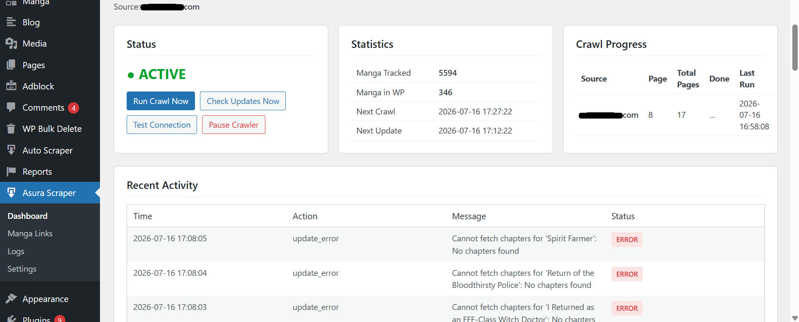
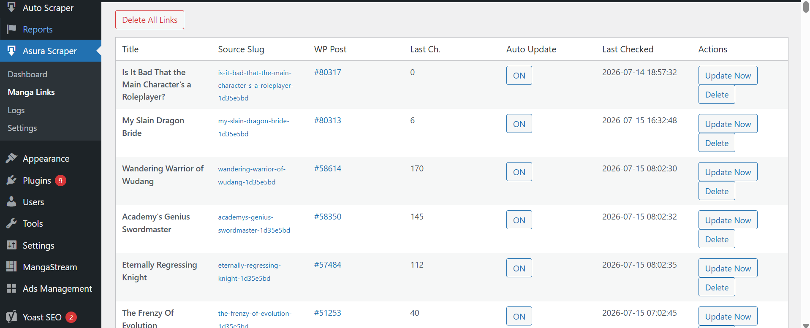
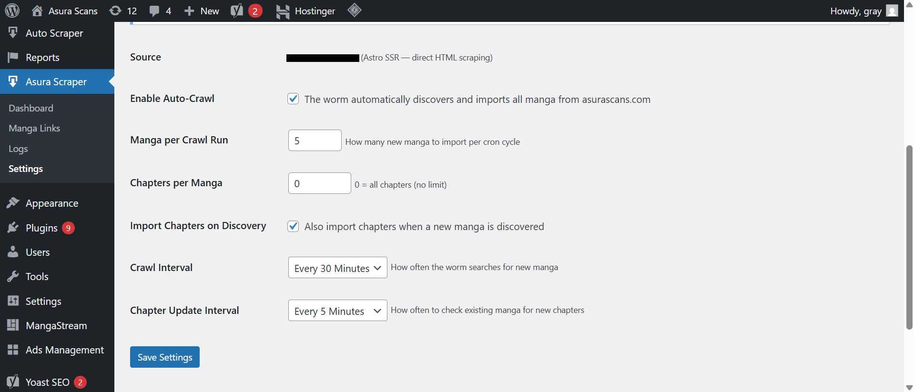

<h1 align="center">MANGA AUTO-SCRAPER & UPLOAD PLUGIN</h1>

  <strong>An advanced automation WordPress plugin designed to scrape, parse, and auto-upload manga chapters directly to your website.</strong>

  
  
  
  

---

## Theme Screenshots

Here is an overview of the plugin admin panel and automation settings:

  <kbd>
    
  </kbd>
   
  <em>Dashboard - Overview of scraping tasks, cron jobs, and success logs</em>

  <kbd>
    
  </kbd>
   
  <em>Sources Configuration - Add target manga sites and define custom selectors</em>

  <kbd>
    
  </kbd>
   
  <em>Queue Manager - Live status of automated chapter uploads and image compression</em>

---

## Key Features

* **Automated Scraping:** Crawls target manga sources to fetch new chapters, titles, and high-quality pages automatically.
* **Smart Auto-Upload:** Automatically creates WordPress posts/pages, structures chapters, and matches them with existing manga titles.
* **WP-Cron Integration:** Runs fully in the background at scheduled intervals (hourly/daily) without slowing down the server.
* **Image Optimization:** Automatically processes, compresses, and saves scraped images to local storage or external CDN.
* **Proxy Support & Anti-Bot Bypass:** Integrated headers and rotating proxy settings to safely scrape without getting blocked.

---

## Built With

  
  
  
  

---

  Developed with passion by <a href="https://github.com/graymh22">Anas Mahmoudi</a>

